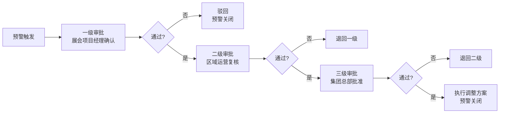
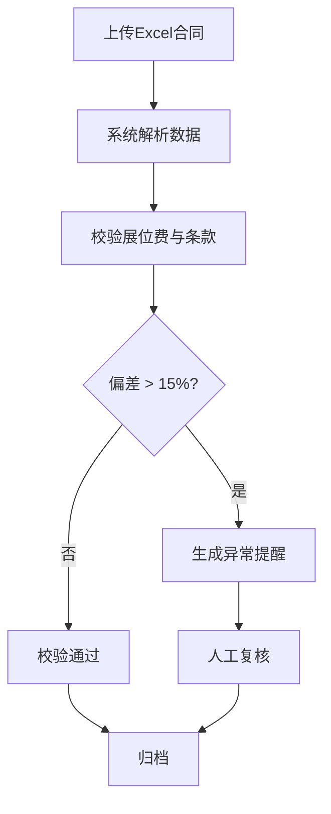

## 1. 产品概述

全国性会展展览活动运营与参展商满意度智能分析平台，实时接入多源数据流，为会展运营管理者提供数据驱动的决策支持。通过全国热力图、满意度排名、预警系统和智能报告，帮助运营团队高效管理全国会展网络，提升参展商满意度和运营效率。

### 核心价值
- **实时监控**：全国会展数据实时聚合与可视化展示
- **智能预警**：多维度异常检测与自动预警推送
- **数据洞察**：深度下钻分析，支持运营决策
- **流程闭环**：三级审批流程，确保决策规范高效

## 2. 核心功能

### 2.1 用户角色

| 角色 | 登录方式 | 核心权限 |
|------|----------|----------|
| 集团总部 | 账号密码 | 全国数据查看、三级审批终审、运营报告查看、权限管理 |
| 区域运营 | 账号密码 | 区域内数据查看、二级审批、区域运营报告 |
| 会展中心 | 账号密码 | 本展馆数据查看、一级审批确认、合同上传 |

### 2.2 功能模块

1. **登录页**：角色选择登录、权限验证
2. **核心看板**：全国热力图、关键指标卡片、满意度排名、预警概览
3. **展馆详情**：7天人流趋势、参展商类型分布、展位利用率
4. **预警中心**：预警列表、三级审批流程、预警处理记录
5. **合同校验**：Excel上传、费用匹配度校验、异常提醒
6. **运营报告**：周度诊断报告、同比环比分析、优化建议
7. **权限管理**：用户管理、角色分配、权限配置（仅总部）

### 2.3 页面详情

| 页面名称 | 模块名称 | 功能描述 |
|----------|----------|----------|
| 登录页 | 登录表单 | 账号密码输入、角色选择、登录验证 |
| 核心看板 | 顶部导航 | 用户信息、角色切换、消息通知 |
| 核心看板 | 指标卡片 | 展位利用率、观众流量、满意度评分、执行效率 |
| 核心看板 | 全国热力图 | 按省份展示会展热度，支持点击下钻 |
| 核心看板 | 行业筛选 | 按行业类别切换数据视图 |
| 核心看板 | 满意度排名 | 城市/展馆满意度排行榜 |
| 核心看板 | 预警概览 | 最新预警列表，快速跳转预警中心 |
| 展馆详情 | 人流趋势 | 近7天观众流量趋势曲线图 |
| 展馆详情 | 参展商分布 | 参展商类型饼图/柱状图 |
| 展馆详情 | 展位信息 | 展位利用率、预订情况 |
| 预警中心 | 预警列表 | 全部预警、待处理、已处理分类 |
| 预警中心 | 审批流程 | 三级审批状态展示、审批操作 |
| 预警中心 | 预警详情 | 预警原因、历史数据、处理建议 |
| 合同校验 | 文件上传 | 拖拽上传Excel合同文件 |
| 合同校验 | 校验结果 | 费用匹配度、偏差分析、异常提醒 |
| 运营报告 | 报告概览 | 本周关键指标摘要 |
| 运营报告 | 流量分析 | 观众流量同比环比 |
| 运营报告 | 投诉分布 | 参展商投诉类型分布 |
| 运营报告 | 优化建议 | 招展策略和服务方案建议 |
| 权限管理 | 用户列表 | 用户账号管理 |
|权限管理 | 角色分配 | 三级角色配置 |

## 3. 核心流程

### 3.1 预警处理流程

用户登录系统 → 查看核心看板预警概览 → 进入预警中心 → 查看待处理预警 → 执行审批操作 → 三级审批完成 → 预警关闭

### 3.2 合同校验流程

用户上传Excel合同 → 系统解析合同数据 → 校验展位费与条款匹配度 → 生成校验报告 → 偏差超15%触发异常提醒

## 4. 用户界面设计

### 4.1 设计风格

**设计方向**：高端商务科技风，体现数据驱动决策的专业感

- **主色调**：深海蓝 (#0A2540) - 代表专业、可信
- **辅助色**：活力橙 (#FF6B35) - 用于预警和关键数据高亮
- **强调色**：翠绿 (#00C9A7) - 表示正常、良好状态
- **警告色**：赤红 (#E74C3C) - 表示异常、警告
- **中性色**：石板灰 (#4A5568) 系列 - 文字和背景

**字体**：
- 标题：Inter 字重 600-700
- 正文：Inter 字重 400-500
- 数据数字：Roboto Mono - 等宽数字便于数据对比

**视觉元素**：
- 卡片式布局，微阴影营造层次感
- 渐变背景增加深度
- 数据可视化采用平滑动画
- 预警采用脉冲动画吸引注意

### 4.2 页面设计概览

| 页面名称 | 模块名称 | UI元素 |
|----------|----------|--------|
| 登录页 | 登录卡片 | 渐变背景、浮动装饰元素、毛玻璃效果卡片 |
| 核心看板 | 指标卡片 | 图标+数据+趋势箭头、渐变底色、悬停上浮效果 |
| 核心看板 | 热力图 | 中国地图着色、 tooltip、省份点击交互 |
| 核心看板 | 排行榜 | 排名序号、进度条、数据标签 |
| 展馆详情 | 趋势图 | 平滑曲线、区域渐变、数据点悬停 |
| 预警中心 | 预警卡片 | 状态标签、优先级标识、时间线 |
| 合同校验 | 上传区域 | 虚线边框、拖拽效果、文件图标 |
| 运营报告 | 报告卡片 | 章节式布局、数据对比、图表组合 |

### 4.3 响应式设计

- **桌面优先**：针对1440px及以上宽屏优化
- **平板适配**：1024px断点，侧边栏收起为图标模式
- **移动适配**：768px断点，顶部导航折叠，卡片单列布局
- **触控优化**：可点击元素最小44px，支持触控手势

### 4.4 动画与交互

- 页面加载：元素渐入，错开延迟
- 卡片悬停：轻微上浮 + 阴影加深
- 数据更新：数字滚动动画
- 预警闪烁：呼吸灯效果
- 图表加载：线条描绘动画
- 模态框：缩放渐入
