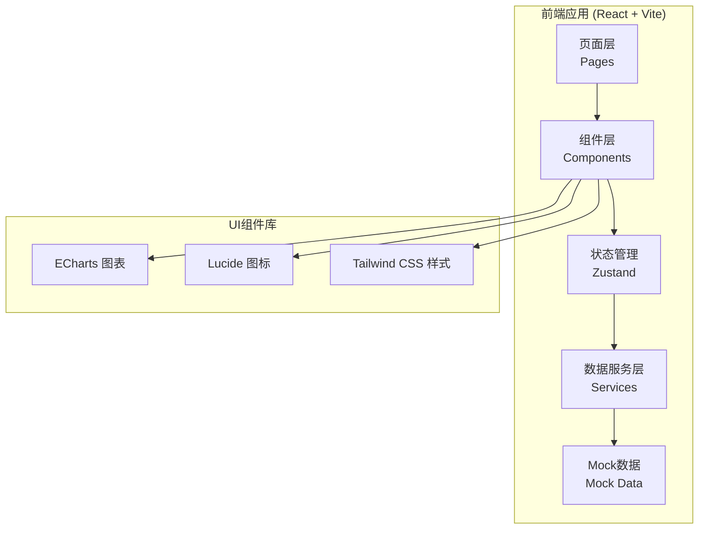
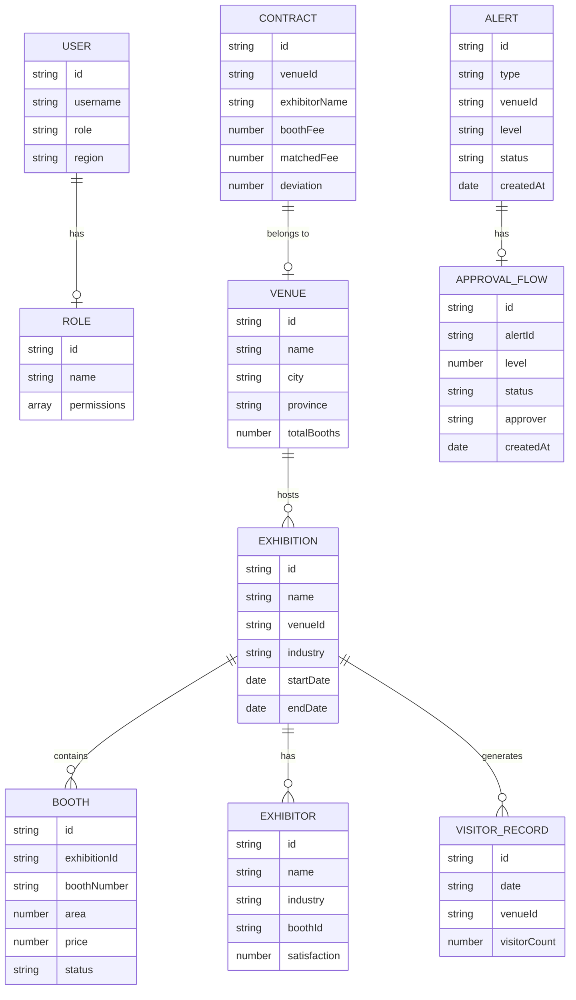

## 1. 架构设计



## 2. 技术描述

- **前端框架**：React@18 + TypeScript
- **构建工具**：Vite@5
- **路由管理**：react-router-dom@6
- **状态管理**：zustand@4
- **样式方案**：Tailwind CSS@3
- **图表库**：echarts@5 + echarts-for-react
- **图标库**：lucide-react
- **文件处理**：xlsx (Excel解析)
- **后端**：纯前端Mock数据，无真实后端

## 3. 路由定义

| 路由 | 页面 | 权限 |
|------|------|------|
| /login | 登录页 | 公开 |
| /dashboard | 核心看板 | 全部角色 |
| /venue/:id | 展馆详情 | 全部角色（数据按权限过滤） |
| /alerts | 预警中心 | 全部角色（操作按权限限制） |
| /contracts | 合同校验 | 会展中心、区域、总部 |
| /reports | 运营报告 | 全部角色 |
| /permissions | 权限管理 | 仅总部 |

## 4. 数据模型

### 4.1 数据实体



### 4.2 Mock数据结构

**模拟数据文件组织**：
- `src/data/mock/venues.ts` - 展馆数据
- `src/data/mock/exhibitions.ts` - 展会数据
- `src/data/mock/visitors.ts` - 观众流量数据
- `src/data/mock/exhibitors.ts` - 参展商数据
- `src/data/mock/alerts.ts` - 预警数据
- `src/data/mock/contracts.ts` - 合同数据
- `src/data/mock/reports.ts` - 报告数据
- `src/data/mock/users.ts` - 用户数据

## 5. 项目结构

```
src/
├── components/          # 通用组件
│   ├── Layout/         # 布局组件
│   │   ├── Sidebar.tsx
│   │   ├── Header.tsx
│   │   └── index.tsx
│   ├── charts/         # 图表组件
│   │   ├── HeatMap.tsx
│   │   ├── LineChart.tsx
│   │   ├── PieChart.tsx
│   │   └── BarChart.tsx
│   ├── ui/             # UI基础组件
│   │   ├── Card.tsx
│   │   ├── Button.tsx
│   │   ├── Modal.tsx
│   │   └── Badge.tsx
│   └── common/         # 业务组件
│       ├── StatCard.tsx
│       ├── AlertCard.tsx
│       └── ApprovalTimeline.tsx
├── pages/              # 页面组件
│   ├── Login.tsx
│   ├── Dashboard.tsx
│   ├── VenueDetail.tsx
│   ├── AlertCenter.tsx
│   ├── ContractVerify.tsx
│   ├── ReportCenter.tsx
│   └── PermissionManage.tsx
├── store/              # 状态管理
│   ├── useAuthStore.ts
│   ├── useAlertStore.ts
│   └── useDataStore.ts
├── data/               # 数据层
│   ├── mock/           # Mock数据
│   └── services/       # 数据服务
│       ├── venueService.ts
│       ├── alertService.ts
│       └── contractService.ts
├── hooks/              # 自定义Hooks
│   ├── useAuth.ts
│   ├── useChartData.ts
│   └── useApproval.ts
├── utils/              # 工具函数
│   ├── format.ts
│   ├── validate.ts
│   └── excelParser.ts
├── types/              # TypeScript类型
│   ├── index.ts
│   └── api.ts
├── App.tsx
├── main.tsx
└── index.css
```

## 6. 关键技术实现方案

### 6.1 全国热力图
- 使用ECharts的中国地图组件
- 按省份聚合展会数量、观众流量数据
- 支持鼠标悬停显示详情、点击下钻

### 6.2 三级审批流程
- 状态机管理审批状态流转
- 按角色权限控制审批操作按钮显示
- 审批时间线可视化展示

### 6.3 Excel合同校验
- 使用xlsx库解析Excel文件
- 预设合同模板字段映射规则
- 费用偏差计算公式：(实际费用-标准费用)/标准费用 * 100%

### 6.4 权限控制
- 路由级权限：通过路由守卫拦截
- 组件级权限：通过权限判断组件显示
- 数据级权限：根据角色过滤返回数据

### 6.5 数据模拟
- 生成真实感的模拟数据
- 支持数据实时更新模拟
- 包含正常数据和异常数据用于演示
